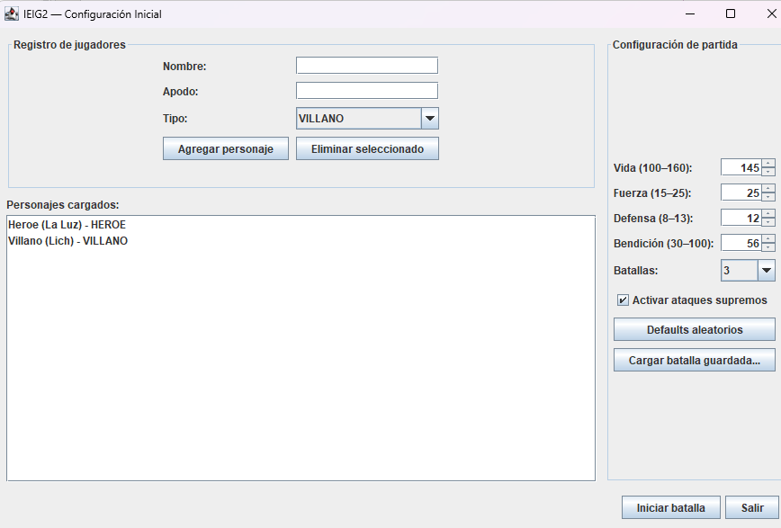

# IE - Interfaz Gráfica

## 📋 Descripción del Proyecto

Este proyecto forma parte de la materia **Interfaz Grafica** y se enfoca en el desarrollo de mejorar la batalla aplicando herencia, polimorfismo, encapsulamiento, arrays y manipulación de Strings

Video Explicativo

https://youtu.be/fxeXCnW-tzI

## 👥 Integrantes del Equipo

- **[Joaquin Ballesteros]** - [Ataque Supremo/Villano] Prompts: https://chatgpt.com/share/68d6a405-7c84-8004-9a09-123f9fa66cb7
- **[Federico Terradas]** - [Ataque Supremo/Heroe]  Prompts: https://claude.ai/share/dd041a24-b8ee-40a2-b069-a28dba2612ab https://chatgpt.com/share/68d82961-a7dc-8002-94da-dd9f62cb9e7a https://claude.ai/share/dcb3e73e-1a2b-4d16-bdf9-da447fc37825
- **[Mateo Bertello]** - [Historial Batallas/Metodos]  Prompts: https://g.co/gemini/share/64e50ca773e6
- **[Mateo Paredes]** - [Historial/Batallas/Metodos]
- **[Lucas Barberis]** - [Reporte Final de la batalla] (trabajo con federico medina)
- **[Federico Medina]** - [Reporte Final de la batalla]
- **[Emanuel Ferrerya]** - [Apodos y validación]
- **[Tomas Mondino]** - [Apodos y validación]


**🔨 Trabajando en IE - Interfaz Gráfica**

El proyecto se encuentra actualmente en desarrollo. Se están implementando las funcionalidades de Ataque Supremo, Historial de Batallas, Sistemas de Apodos y Validacion, Sistema de Reportes




## 📁 Estructura del Proyecto

```
IGIE1/
├── src/IE.java
├── img/
└── README.md
```

## 🚀 Instalación y Uso

```bash
# Clonar el repositorio
git clone https://github.com/JoakoBallesteros/IGIE1.git

# Navegar al directorio
cd IGIE1

# Ejecutar el proyecto
Run en IDE correspondiente
(NetBeans)

## 📞 Contacto

Para consultas sobre este proyecto, contactar a cualquiera de los integrantes del equipo.

---

*Proyecto desarrollado para la materia Interfaz Grafica*
