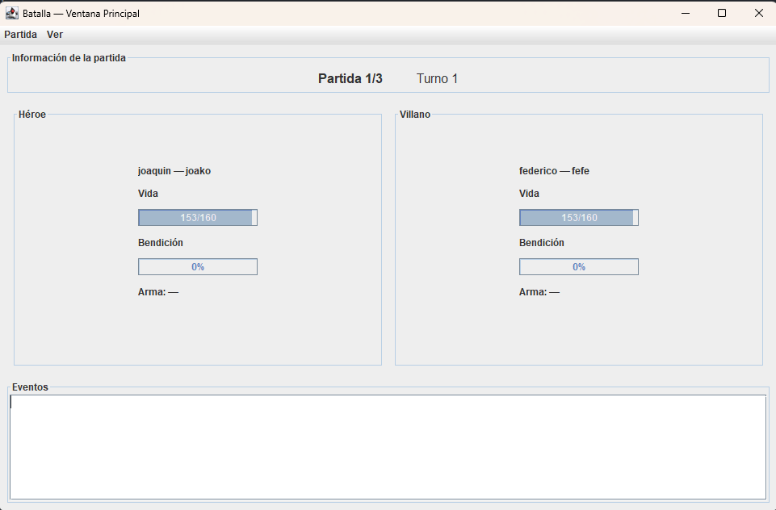

# IE - Interfaz Gráfica

## 📋 Descripción del Proyecto

Este proyecto es parte de la materia **Interfaz Gráfica** y tiene como objetivo mejorar la batalla implementando una arquitectura **MVC (Modelo-Vista-Controlador)**, con énfasis en el uso de **herencia**, **polimorfismo**, **encapsulamiento**, **arrays** y **manipulación de Strings**. 

A través de una interfaz interactiva, se busca proporcionar una experiencia de juego dinámica, integrando funcionalidades de configuración de personajes, estadísticas y almacenamiento de partidas.

**Objetivo del Proyecto:**
- Reestructurar el proyecto original a arquitectura **MVC**.
- Implementar ventanas de configuración y un sistema de reporte completo.
- Añadir un sistema de persistencia de datos.

**Video Explicativo:**
[Enlace al video](#)https://youtu.be/aOxy_Vcf4EU?si=KYKOxKabj9v0JrHL


## 👥 Integrantes del Equipo

- **[Bertello Mateo]** - [ Reestructurar el proyecto en arquitectura MVC] Prompts: https://gemini.google.com/share/c8aa91fa9427
- **[Federico Terradas]** - [ Implementacion de la ventana de configuracion, Cambio de main class en el proyecto ] https://chatgpt.com/share/690d1528-0b64-8004-94d7-0e8c223d13bf
- **[Joaquin Ballesteros]**- [ Ventana de batalla y configuracion de menu ] https://chatgpt.com/g/g-p-68d68cba08e88191823d38a84b1f30d1-tareas-escolares/c/6910b15c-c07c-8331-867d-394eab608b7a
- **[Lucas Babreris]**
- **[Federico Medina]** -
- **[Emanuel Ferreyra]**- [Ventana de reportes, Ranking, Historial y estadisticas]
- **[Tomas Mondino]**- [Ventana de Resportes, Estadisticas]
- **[Mateo Paredes]**- [Ventana de Reportes, Historial]


## 🔨 Funcionalidades Implementadas

- Reestructuración del proyecto a arquitectura **MVC**.
- **Ventana de Configuración Inicial**: Permite registrar jugadores, asignar características y validar configuraciones.
- **Ventana Principal de Juego**: Información dinámica sobre el estado de los personajes, estadísticas y eventos en la batalla.
- **Reporte Final**: Resumen con estadísticas detalladas, ranking y el historial de batallas.
- **Persistencia de Datos**: Guardado y carga de partidas usando archivos de texto.

##  Capturas
Configuracion Inicial


Pantalla Principal


## 📁 Estructura del Proyecto

```
IEIG2/
├── src/
│   ├── ieig2/
│   │   └── IEIG2.java             
│   │
│   ├── ieig2/modelo/
│   │   ├── Personaje.java          
│   │   ├── Heroe.java
│   │   ├── Villano.java
│   │   ├── Arma.java
│   │   ├── Apodo.java
│   │   ├── Validacion.java
│   │   └── HistorialBatallas.java  
│   │
│   ├── ieig2/vista/
│   │   ├── BatallaVistaConsola.java       
│   │
│   └── ieig2/controlador/
       └── BatallaControlador.java 

```

## 🚀 Instalación y Uso

```bash
# Clonar el repositorio
git clone https://github.com/MateoBertello/IGIE2.git

# Navegar al directorio
cd IGIE2

# Ejecutar el proyecto
Run en IDE correspondiente
(NetBeans)

## 📞 Contacto

Para consultas sobre este proyecto, contactar a cualquiera de los integrantes del equipo.

---

*Proyecto desarrollado para la materia Interfaz Grafica*
